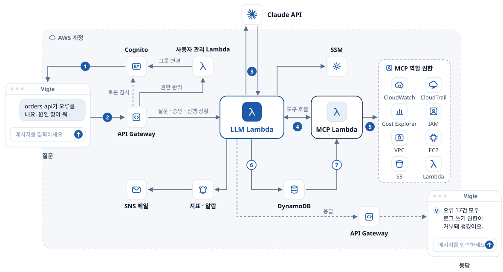

<p align="center">
  <picture>
    <source media="(prefers-color-scheme: dark)" srcset="./frontend/src/assets/brand/vigie-logo-white.svg">
    
  </picture>
</p>

# Vigie - AWS 장애 진단 및 변경 통제 에이전트

AI가 장애를 진단하고, 변경은 사람이 승인해야 실행되는 AWS 운영 에이전트입니다.

## 개요

"어젯밤 누가 보안 그룹을 열었지?", "web-alb가 왜 503을 내지?" 같은 질문에 답하려면 CloudWatch, CloudTrail, IAM, EC2 콘솔을 오가야 합니다. Vigie는 이 조회와 진단을 AI에게 맡기되, AWS를 바꾸는 일은 사람이 승인해야만 일어나게 만든 에이전트입니다.

- **판단과 실행을 나눕니다**: 모델(Claude)은 질문을 해석해 도구를 고르고 답을 씁니다. 도구 호출은 정해진 코드가 분류해서, 조회는 바로 실행하고 AWS를 바꾸는 변경은 사람이 버튼으로 승인해야 실행합니다([9번](docs/features.md#9-변경-작업-승인)).
- **장애 원인을 정해진 절차로 찾습니다**: 서비스 8종의 진단 절차를 런북처럼 코드로 옮겨, 같은 장애에는 같은 판정이 나오고 판정마다 근거가 붙습니다. 모델은 판정을 읽고 설명과 다음 조치만 씁니다([2번](docs/features.md#2-조회와-진단-도구)).
- **권한만큼만 보이고, 계정 밖으로는 가린 데이터만 나갑니다**: 관리자 전용 도구는 일반 사용자의 모델에게 보이지 않고, 키와 계정 ID 같은 값은 Claude로 보내기 전에 가립니다([7번](docs/features.md#7-민감정보-가리기), [10번](docs/features.md#10-사용자-관리)).
- **모든 행동이 남고, 거꾸로 따라갈 수 있습니다**: 질문, 도구 호출, 승인, 실행을 감사 기록으로 남기고, 변경 하나를 처리 단계 7개로 거슬러 올라가 어디서 어긋났는지 짚습니다([8번](docs/features.md#8-감사-로그)).
- **서버 없이 관리형 서비스로**: Lambda, API Gateway, DynamoDB, Cognito 위에 만들었고, 환경은 CloudFormation 템플릿과 배포 스크립트 한 번으로 세웁니다([12번](docs/features.md#12-간편한-배포)).

지금은 비슷한 일을 하는 관리형 서비스가 있지만, 그 전에 같은 문제를 직접 풀어 본 토이 프로젝트입니다.

## 아키텍처



1. 웹이 Cognito로 로그인해 토큰을 받습니다.
2. 토큰을 붙여 API Gateway로 질문하면 API Gateway가 Cognito로 토큰을 검사합니다.
3. LLM Lambda가 가린 질문과 도구 결과만 Claude API에 보냅니다.
4. LLM Lambda가 SigV4로 서명해 MCP Lambda에 도구를 호출합니다.
5. MCP Lambda가 MCP 역할 권한 안에서만 AWS 서비스를 부릅니다.
6. LLM Lambda가 대화, 승인, 감사, 진행 상황을 DynamoDB에 남깁니다.
7. MCP Lambda가 변경을 실행하기 직전에 승인 기록을 다시 읽습니다.

점선은 응답입니다. 답은 API Gateway를 거쳐 웹으로 돌아갑니다. 오른쪽 API Gateway는 왼쪽과 같은 게이트웨이이고, 응답이 나가는 길을 나눠 보이려고 한 번 더 그렸습니다. Slack 봇과 대화 기록, 대시보드 Lambda는 그림에서 뺐습니다([CloudFormation 스택 구성](docs/deployment.md#cloudformation-스택-구성) 참고).

## 주요 기능

| 기능 | 하는 일 |
|:--|:--|
| [자연어 질의응답](docs/features.md#1-자연어-질의응답) | 묻는 말에 맞춰 Claude가 도구를 골라 조회하고 답합니다. 부른 도구와 진행 상황이 화면에 보입니다 |
| [조회와 진단 도구](docs/features.md#2-조회와-진단-도구) | CloudWatch, 비용, EC2, S3, 문서 조회와 서비스 8종의 진단 절차. 계정 정찰에 쓰일 수 있는 도구는 관리자 전용입니다 |
| [민감정보 가리기](docs/features.md#7-민감정보-가리기) | 비밀 값은 지우고, 계정 ID와 이메일은 가명으로 바꿔 Claude로 보냅니다 |
| [감사 로그](docs/features.md#8-감사-로그) | 질문, 도구 호출, 승인, 실행을 추가만 되는 기록으로 남기고, 변경 하나를 처리 단계 7개로 역추적합니다 |
| [변경 작업 승인](docs/features.md#9-변경-작업-승인) | 변경 도구는 실행하지 않고 승인 카드를 만들고, MCP가 실행 직전에 승인을 다시 읽어 한 번만 실행합니다 |
| [사용자 관리](docs/features.md#10-사용자-관리) | 일반 사용자, 결정자, 관리자 세 단계 권한을 따로 된 Lambda와 역할로 관리합니다 |
| [프롬프트 인젝션 방어](docs/features.md#11-프롬프트-인젝션-방어와-거버넌스-지표) | 도구 결과를 데이터로 격리하고 지시문을 탐지하며, 거버넌스 지표와 AI가 끌 수 없는 알람을 둡니다 |

차트와 다이어그램, 문서 기반 답변, Slack 봇, 대화 기록까지 포함한 전체 설명은 [docs/features.md](docs/features.md)에 있습니다. 막는다고 적은 위협과 그것을 확인하는 테스트, 아직 막지 못한 위험은 [위협 모델](docs/threat-model.md)에 정리했습니다.

## 기술 스택
- **AWS**: Lambda(Python 3.12, MCP 서버는 컨테이너 이미지), API Gateway, Cognito, DynamoDB, S3, SSM, CloudWatch, EventBridge, CloudFormation, CodeBuild, ECR, Amplify
- **AI**: Claude(Anthropic API), MCP. AWS 공식 MCP 서버 7개(CloudWatch, 문서, Cost Explorer, CloudTrail, 가격표, IAM 조회, 네트워크)에 직접 만든 도구와 진단 절차를 더했습니다
- **Frontend**: React 18, TypeScript, Vite, Zustand
- **테스트와 배포**: pytest, moto, ruff, GitHub Actions(OIDC)

## 빠른 시작

### 준비
- AWS CLI, Python 3.12 이상, Node.js 18 이상
- 배포 리전은 `AWS_REGION` 환경 변수 → CLI 프로필의 리전 → 서울(`ap-northeast-2`) 순서로 정해집니다.
- Service Quotas -> API Gateway -> Maximum integration timeout in milliseconds -> 120000ms로 변경 요청(자동 승인. 120000ms를 넘는 값은 추가 승인이 필요)

### 비밀 값
루트 `.env`(예시는 `.env.example`)에 `ANTHROPIC_API_KEY`를 적으면 `deploy.sh`가 SSM에 SecureString으로 올립니다. `.env` 없이 배포하거나 Slack 봇을 쓰면 직접 등록합니다.

```bash
aws ssm put-parameter --name "/vigie/${Environment}/ANTHROPIC_API_KEY" --value "your-anthropic-key" --type "SecureString"
aws ssm put-parameter --name "/vigie/${Environment}/SlackbotToken" --value "your-slack-token" --type "SecureString"
aws ssm put-parameter --name "/vigie/${Environment}/SlackSigningSecret" --value "your-slack-signing-secret" --type "SecureString"
```

### 배포
```bash
# 배포 도구: 점검 → 설정 → 배포 → 검증 (이미 된 단계는 건너뜀)
installer/core/vigie-installer check --env dev
installer/core/vigie-installer setup --env dev
installer/core/vigie-installer deploy --env dev
installer/core/vigie-installer verify --env dev

# 또는 배포 스크립트만 (관리자 계정과 알람 메일을 함께 정할 수 있음)
ADMIN_EMAIL=admin@example.com ALARM_EMAIL=you@example.com ./deploy.sh dev
```

재배포 동작, 관리자 계정, 알람과 대시보드, GitHub Actions 배포는 [docs/deployment.md](docs/deployment.md)에 있습니다.

## 개발

```bash
cd frontend && npm install && npm run dev:mock   # AWS 없이 화면만 (가짜 API, 데모와 같음)
pip install -r requirements-dev.txt && pytest     # 백엔드 테스트 (moto로 AWS 없이)
```

가짜 AWS에 장애를 심고 Vigie 대화창에서 진단해 보는 로컬 재현, 데모 사이트 배포, CI는 [docs/development.md](docs/development.md)에 있습니다.

## 팀 구성과 담당 범위
2025년 4~6월 학부 캡스톤디자인(WeGoAWS 팀)에서 AWS 운영을 돕는 AI 챗봇으로 시작했습니다. 본인([@newbiehwang](https://github.com/newbiehwang))은 다음 영역을 맡았습니다.
- **인프라 / IaC**: `cloudformation/` 전체 스택 설계 및 작성
- **배포 자동화**: `deploy.sh` 통합 배포 스크립트, CodeBuild 기반 MCP 컨테이너 이미지 빌드
- **LLM·MCP 백엔드**: `services/llm`, `layers/common`, `mcp/` (MCP 서버는 팀원과 나눠 작업)

2026년 9월부터는 혼자 고도화했습니다. API 인증과 IAM 최소 권한, GitHub OIDC 배포, React 화면, AWS 공식 MCP 서버 전환, 도구 검색, 민감정보 가리기, 변경 승인, 감사 로그와 역추적, 프롬프트 인젝션 방어, 서비스 진단 절차, 로컬 장애 재현, 배포 도구가 이때 만든 것입니다.

<details>
<summary>캡스톤 당시 화면 (AWS Cloud Agent, 2025)</summary>
<br>

</details>

## 링크

- **데모**: [vigie-opal-chi.vercel.app](https://vigie-opal-chi.vercel.app) (로그인 없이 써 볼 수 있습니다. 공개된 가상 회사의 AWS 운영 기록으로 답합니다)
- **포트폴리오**: [vigie-portfolio.vercel.app](https://vigie-portfolio.vercel.app)
- **문서**: [기능 상세](docs/features.md) · [배포와 운영](docs/deployment.md) · [개발과 테스트](docs/development.md) · [위협 모델](docs/threat-model.md)
- **이슈**: [GitHub Issues](https://github.com/newbiehwang/Vigie/issues)
